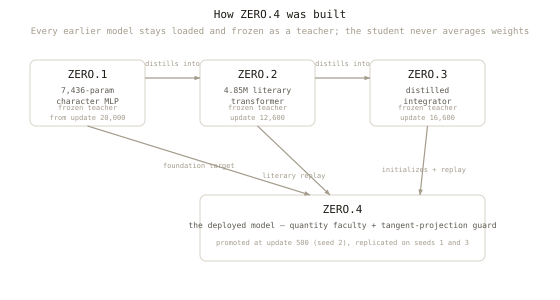
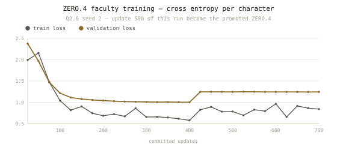
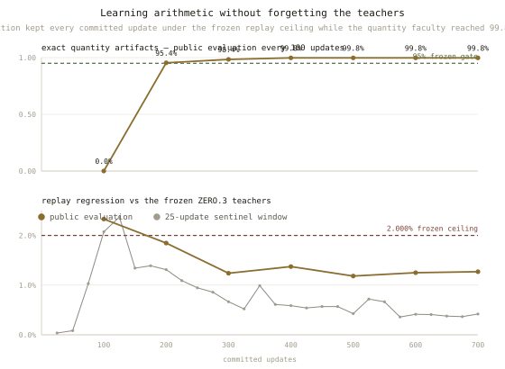
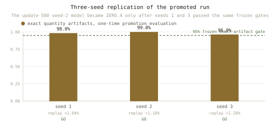
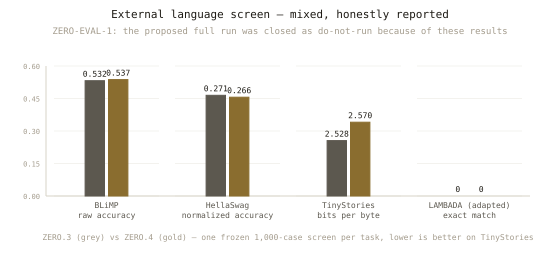
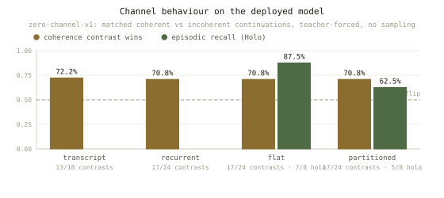

# ZERO.4 model card

ZERO.4 is a 4,852,992-parameter, character-level decoder-only transformer with
a 512-character context, written in dependency-free C11, trained under
preregistered gates, and promoted on 2026-07-24 after three seeds passed the
frozen replication contract. It runs locally as C or in the browser through
the same inference code compiled to WebAssembly. No prompt or generated text
is ever sent to a server.

There is a visual version of this card at
[`docs/model-card.html`](docs/model-card.html) (served on GitHub Pages), and
the chat itself runs at the project page root.

## Model details

| | |
| --- | --- |
| Parameters | 4,852,992 |
| Architecture | 6 transformer blocks, 8 attention heads, 256-dim embeddings, 1056-dim FFN, parameter-free rotary positions, tied embedding/output weights |
| Vocabulary | 128-character normalized ASCII, character-level, no merges |
| Context | 512 characters |
| Objective | next-character cross entropy, replayed against frozen teachers |
| Release artifact | `docs/model.litq8` — 4,920,400 bytes, row-wise signed int8 with floating-point row scales and normalization gains |
| Artifact SHA-256 | `44b32f2262be2754fd2eeaf16ed206bae32b4ce30d7f5541a1059cd21257ae50` |
| Selected at | Q2.6 seed 2, update 500 (prospectively, before replication) |
| Runtime | C11 (`literary_infer`) and WebAssembly, no external ML, tensor, or tokenizer libraries; no network calls |
| Code license | Apache 2.0 |
| Artifact license | CC BY-SA 4.0 |

## How it was built



ZERO.4 was not trained from random weights onto a pile of text. Each
generation was trained against frozen, immutable teachers from earlier
generations; the student never averages weights, and the teachers never change
under it.

| Frozen teacher | What it is | What it constrains |
| --- | --- | --- |
| ZERO.1 | 7,436-parameter character MLP (update 20,000) | the explicit foundation stream only |
| ZERO.2 | 4.85M literary transformer (update 12,600) | replayed on every source to limit forgetting |
| ZERO.3 | distilled integrator (update 16,600) | initializes the student; holds the replay baseline |

On foundation sequences the student minimizes
`0.60 * observed + 0.15 * ZERO.2 + 0.25 * ZERO.1`; on all other streams
`0.85 * observed + 0.15 * ZERO.2`. Teacher hashes are pinned in
[`teachers/registry.json`](teachers/registry.json) and verified during
training.

The quantity faculty adds typed operation records, but the model never
computes arithmetic itself. It learns to emit the correct *request*; an
input-bound deterministic kernel alone calculates and commits exact results,
and the controller rejects mismatched arguments. Small models cannot copy
numbers reliably — six preregistered experiments demonstrated it — but they
can learn when to delegate.

## Training

The promoted run (Q2.6, seed 2) trained for 700 updates on one CPU core.
Before every commit, the candidate update was projected off the direction
that would hurt replay (the arithmetic-mean gradient of six frozen replay
windows), then accepted only if cumulative replay stayed within the frozen
1.5% budget. All 700 attempts committed; 423 were projected; the guard never
had to reject anything.





Source records:
[`training.log`](benchmarks/zero4-q26-v1/seed2/training.log),
[`events.jsonl`](benchmarks/zero4-q26-v1/seed2/events.jsonl),
[`RESULTS.md`](benchmarks/zero4-q26-v1/seed2/RESULTS.md).
The full decision lineage of all experiments — including the six no-gos — is
in [`EXPERIMENTS.md`](EXPERIMENTS.md).

## Replication

The update-500 model became ZERO.4 only after seeds 1 and 3 passed the same
frozen contract, with no post-hoc selection and no optional stopping.



Source: [`benchmarks/zero4-q26r-v1/aggregate.json`](benchmarks/zero4-q26r-v1/aggregate.json).

## Evaluation

A 4.85M character model does not become a general assistant. These are the
measured results on frozen, preregistered evaluations — including the
disappointing ones.



On the frozen 1,000-case-per-task external screen, ZERO.4 versus ZERO.3 was
+0.005 raw accuracy on BLiMP, −0.005 normalized accuracy on HellaSwag, worse on
TinyStories bits per byte, and tied at zero adapted-LAMBADA exact matches.
These are weak results by modern general-language-model standards and should
not be overstated; the proposed full evaluation was closed as `do_not_run` on
this evidence. Source:
[`zero-eval-1`](benchmarks/zero-eval-1/screen/results/result.json).



The frozen `zero-channel-v1` diagnostic measured matched coherent/incoherent
continuations (teacher-forced, no sampling) and deterministic episodic recall
on the ZERO.3-era int8 export. Contrast win rates are around 70% across the
four bounded runtime policies; flat episodic recall passed 7/8 checks and the
first partitioned routing design 5/8. This is a corpus proxy, not a semantic
verifier. Source:
[`baseline.json`](benchmarks/zero-channel-v1/results/baseline.json),
[`BASELINE.md`](benchmarks/zero-channel-v1/results/BASELINE.md).

The release set also passes a deterministic prompted-continuation overlap
check ([`zero4-memorization-v1.json`](release/zero4-memorization-v1.json)).
It is a release gate, not proof that memorization is impossible. Training text
and token streams are deliberately excluded from the release artifact set.

## Intended use and out-of-scope use

**Intended:** research on small models; teaching (every operation is readable
C); regression testing; studying replay-protected continual learning and
delegated-tool correctness; running a chat model with zero server dependency.

**Not intended:** general assistance, factual question answering, production
chat with real people, any claim of general language skill, or use in
safety-critical or child-facing contexts.

## Training data

Project-authored foundation statements; Shakespeare and Blake editions
identified by Project Gutenberg as public domain in the USA; Crowley works
from Project Gutenberg and CC BY-SA Wikisource transcriptions; a deliberately
low-weight King James Bible stream; literary dialogue records derived from
those sources; and project-generated typed quantity-operation records.
**No human chat export appears in the bound training lineage.** Full
provenance, permanent attribution, transformations, and jurisdiction notes
are in [`CORPUS_RIGHTS.md`](CORPUS_RIGHTS.md); license boundaries are in
[`LICENSES.md`](LICENSES.md).

## Known weaknesses

External scores are weak; greedy generation can loop; the channel memory is
lossy and the episodic index is exact hash-recall, not learned retrieval;
quantity delegation is honest only because the kernel is input-bound and the
controller rejects mismatched arguments.

## Verify everything yourself

```sh
node scripts/render_model_card_charts.mjs   # regenerate every chart above
make zero4-promotion-check                  # verify the frozen promotion record
make web                                    # reproduce the deployed artifact
./literary_infer docs/model.litq8 "The zero opened its eyes, and" 240
```

Also on the record: the [Hugging Face release](https://huggingface.co/atimics/zero4)
mirrors the artifact, the minimal C runtime, and the corpus-rights audit.
