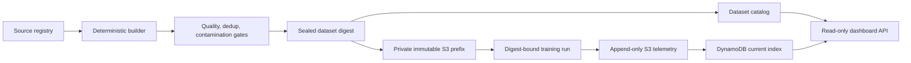

# ZERO data pipeline

ZERO now treats the corpus as a versioned model input rather than a directory
of convenient text files. A run is reproducible only when it records the
64-character dataset digest it materialized.



## Contracts

- `corpus/registry/zero-literary-v1.json` names every source, origin, license,
  sampling weight, expected hash, tokenizer, split rule, and held-out
  contamination panel.
- `schemas/corpus-sources.schema.json` defines the source registry.
- `schemas/dataset-manifest.schema.json` defines a sealed dataset.
- `schemas/training-telemetry.schema.json` defines an append-only run event.
- `infra/zero-data-plane.yaml` provisions the private corpus bucket, dataset
  catalog, run index, and public read-only dashboard API. The bucket and both
  tables are retained if the stack is removed.

The S3 layout is content addressed:

```text
s3://zero-corpus-ACCOUNT/datasets/DATASET/VERSION/DATASET_SHA256/
  source-registry.json
  sources/
  documents/
  text/
  tokens/
  reports/
  tokenizer.bpe
  manifest.json
  READY
```

`READY` is written last. Promotion uses conditional object writes and refuses
to reuse a key whose SHA-256 metadata differs. Dataset identity covers the
manifest body and every artifact binding; it does not depend on an upload time,
machine path, or S3 version ID.

## Build and inspect

```sh
make zero-data-pipeline-check
make zero-data-build
cat build/zero-literary-v1/reports/quality.json
cat build/zero-literary-v1/reports/contamination.json
```

The first registry yields 467 source-stratified documents and about 1.046
million words. Large sources receive deterministic train, validation, and test
members; a source too small to split remains train-only. The builder removes
exact duplicates, detects high-similarity documents with 5-word SimHash, and
blocks promotion when a 12-word shingle intersects the bound private semantic
panel. Token streams are generated by Zero's C tokenizer and split only on
16-bit token boundaries.

Two builds from the same commit must produce byte-identical manifests and the
same dataset digest. The pipeline check enforces this property.

## Sero pretraining expansion

The first large Sero corpus uses three fixed Wikimedia snapshots with equal
42-million-byte cleaned source caps. This keeps encyclopedia, instructional,
and news text from overwhelming one another. Raw files are checked against the
official SHA-1 list. WikiExtractor is pinned by commit, and selection uses a
stable minimum hash of the page and revision IDs.

```sh
make sero-corpus-plan-check
make sero-corpus-prepare
make sero-corpus-build
make sero-corpus-result-check
```

The preparation stage writes source text and per-page attribution under
`build/sero-corpus-v1/`. The dataset stage writes the sealed corpus under
`build/sero-pretrain-v1/`. Both directories are generated and remain outside
git. See `corpus/SERO_PRETRAIN_RIGHTS.md` for the license review and its limits.

## Deploy and promote

The data control plane is deliberately separate from the existing training
artifact bucket:

```sh
AWS_REGION=us-east-1 scripts/aws/deploy-data-plane.sh

account_id=$(aws sts get-caller-identity --query Account --output text)
node scripts/promote_zero_dataset.mjs \
  --build build/zero-literary-v1 \
  --bucket "zero-corpus-${account_id}" \
  --table zero-datasets \
  --approval-id zero-literary-2026-08-12-v1
```

Manifests that seal text before tokenization can pass `--train-tokens` after a
digest-bound tokenizer run. The catalog publisher derives source and quality
metadata from split rows and `reports/quality.json` when the manifest does not
carry the older top-level fields. Existing objects without SHA-256 metadata are
downloaded and hashed before they are accepted; matching catalog rows can be
refreshed only when their immutable dataset digest is unchanged.

The manual `Publish immutable ZERO corpus` workflow performs the same build and
promotion from an exact main-branch commit. It never launches training compute.

## Materialize for training

A training host requests all three identifiers and refuses any mismatch:

```sh
node scripts/materialize_zero_dataset.mjs \
  --dataset-id zero-literary \
  --version 2026-08-12.v1 \
  --digest DATASET_SHA256 \
  --bucket zero-corpus-ACCOUNT \
  --out /opt/zero/dataset
```

The materializer checks the catalog, downloads `READY` and the manifest,
recomputes the dataset digest, downloads the document splits, tokenizer, and
token shards, and verifies every byte before creating `training-inputs.json`.
The document files are required by byte-level and latent-token experiments.
New launchers must read that file; they must not sync or train from the mutable
legacy `corpus/` prefix.

## Publish run telemetry

The telemetry publisher archives the full event under the existing private
training bucket, then conditionally advances the DynamoDB snapshot only when
the sequence number is newer:

```sh
node scripts/publish_zero_telemetry.mjs \
  --run-id zero5-pretrain-seed1 \
  --sequence 0 \
  --kind run.started \
  --occurred-at "$(date -u +%Y-%m-%dT%H:%M:%SZ)" \
  --dataset-digest DATASET_SHA256 \
  --payload /tmp/run-start.json \
  --bucket zero-training-ACCOUNT
```

Use monotonically increasing sequence numbers for `phase.started`, `metric`,
`checkpoint`, and the terminal `run.completed` or `run.failed` event. Preserve
the original `occurred-at` value when retrying: the full event ID and S3 key are
derived from canonical content, so that retry is idempotent.
The dashboard snapshot retains common fields (`experiment`, `seed`, `update`,
`loss`, `accuracy`, `decision`, and `compute_usd`) and the merged payload.

Historical runs without a trustworthy dataset binding are explicitly indexed
with `dataset_digest=unknown`; the import path never invents lineage.

## Dashboard

`docs/dashboard/` is the read-only training ledger. It calls only `GET
/datasets`, `GET /runs`, and `GET /runs/{id}`. Corpus bytes, checkpoints, S3
locations usable for writes, and credentials are never served.

After the stack is deployed, set the `DashboardApiUrl` output in
`docs/dashboard/config.json`. The main ZERO.4 page links to the ledger under
**TRAINING**.

## Adding data

1. Preserve the raw source and record its origin, license, SHA-256, and intended
   weight in a new registry version.
2. Bind every private evaluation panel before building.
3. Run the pipeline check and inspect all three reports.
4. Promote once under a new semantic version. Never edit a promoted version.
5. Require the resulting digest in the training contract and telemetry.
6. Compare downstream validation by source, not only aggregate loss.

This is the base for scaling Zero into a real pretrained model: future web,
book, code, and synthetic mixtures add source adapters and stronger quality
classifiers ahead of the same immutable contract. They do not bypass it.
